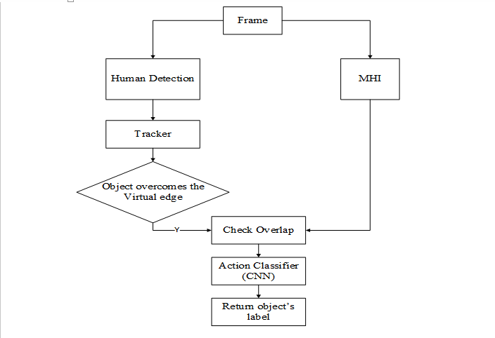
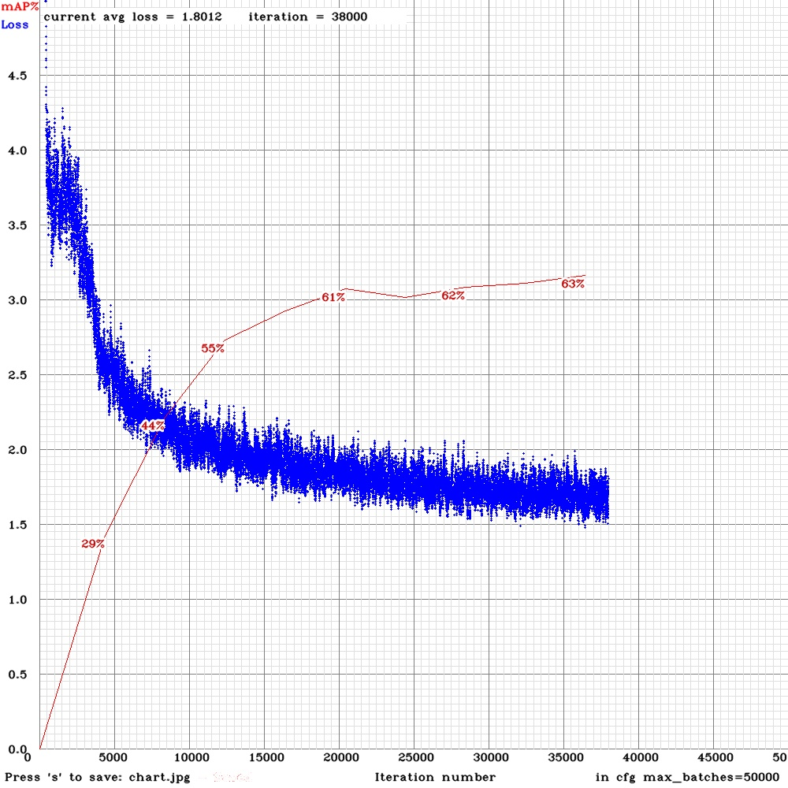
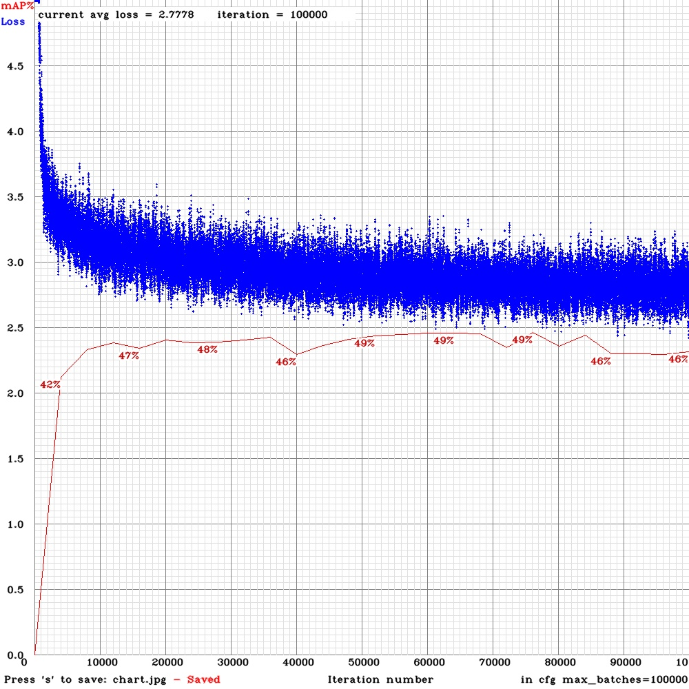
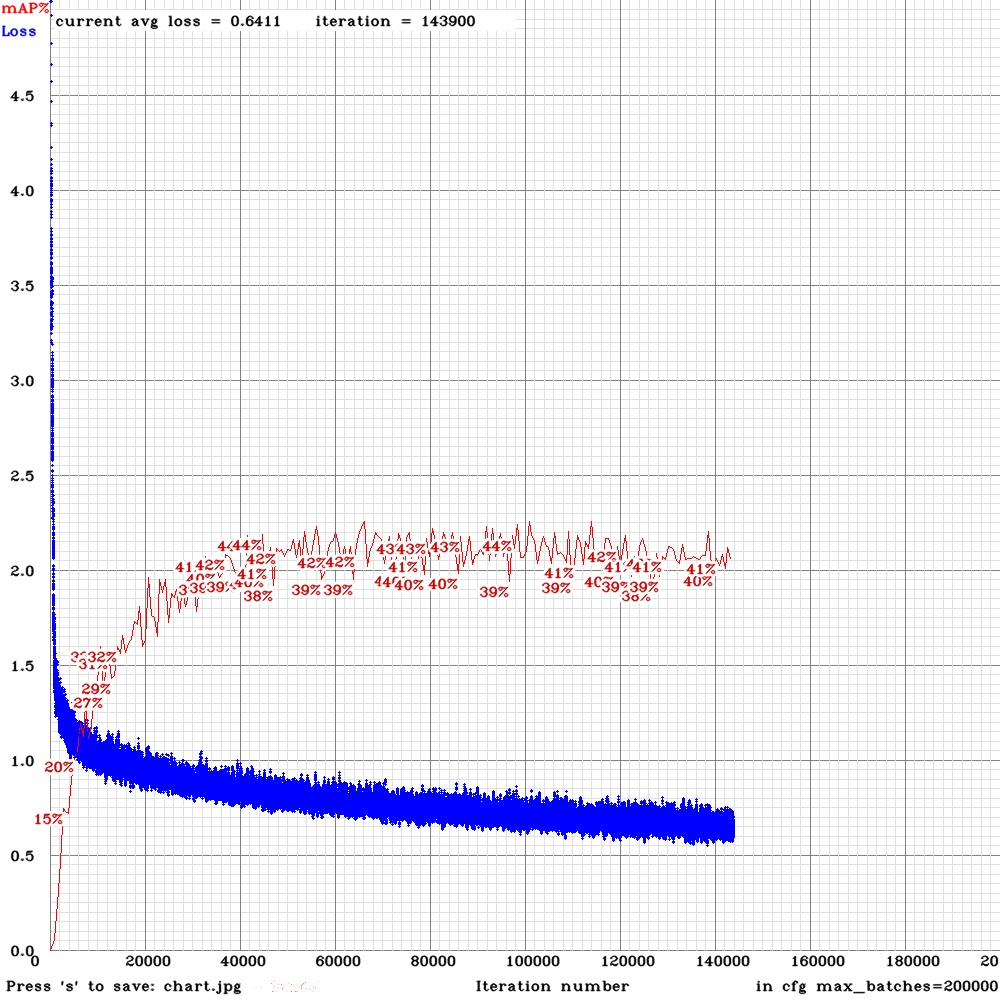

# In Dataset:
----
    You can use commandLine to download image data. For example, in order to download COCO2014:

            wget -c https://pjreddie.com/media/files/train2014.zip
            wget -c https://pjreddie.com/media/files/val2014.zip
            unzip -q train2014.zip
            unzip -q val2014.zip

    But the sizes of these data are really big, I higly recommend you choose a download manager, and then unzip them

# In Dev:
----
    In this project, I extract my own data from COCO data. You can also do the same thing with VOC data by yourself
    But the original data should be put in the folder Dataset/

# In Network model:
----
    You have to reconfig Network if you want to train your own dataset

    In this project, for example, I add my-person-yolo.cfg (modified from yolo.cfg)
                                        my-person.data (modified from coco.data)
                                        my-person.names (modified from coco.names)

# In Action Classification:
----
    Include Action Classification Model 
    [Link Training Dataset](https://drive.google.com/file/d/1GgJdjlYDKF6RJYlI82pQMgsR1ye7awq6/view?fbclid=IwAR3HqIDXJp4S_a2HfKKPWTEzFxOLQvsho-F5GY_APRbSPfUHAeM0yoo26nc) 

# Result:
----
* **System Design**
     

 
 

* **Model Comparison**

    Optimal Model| retrained Yolov3 Model | Pruin_darknet Model
    |:-------------------------:|:-------------------------:|:-------------------------:|
     | | 
    
